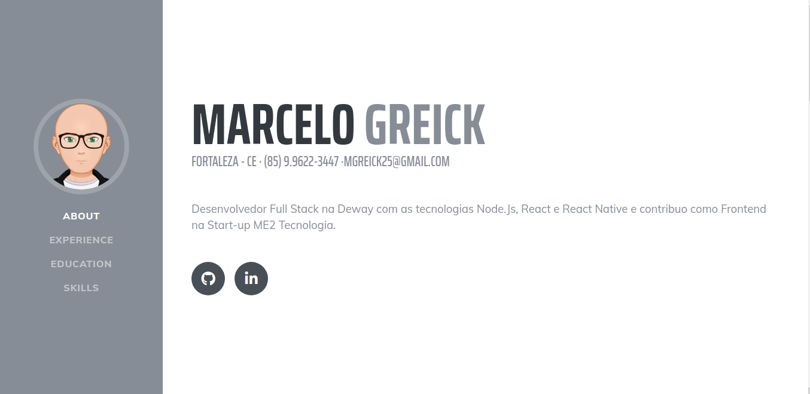

# gatsby-starter-resume

Gatsby.js V2 modelo inicial baseado em currículo por startbootstrap

Para uma visão geral da estrutura do projeto, consulte o [Gatsby documentation - Building with Components](https://www.gatsbyjs.org/docs/building-with-components/).

## Screenshot



## Install

Certifique-se de ter o programa Gatsby CLI instalado:

```sh
npm install --global gatsby-cli
```

And run from your CLI:

```sh
gatsby new <site-name> https://github.com/anubhavsrivastava/gatsby-starter-resume
```

Then you can run it by:

```sh
cd gatsby-example-site
npm install
gatsby develop
```
